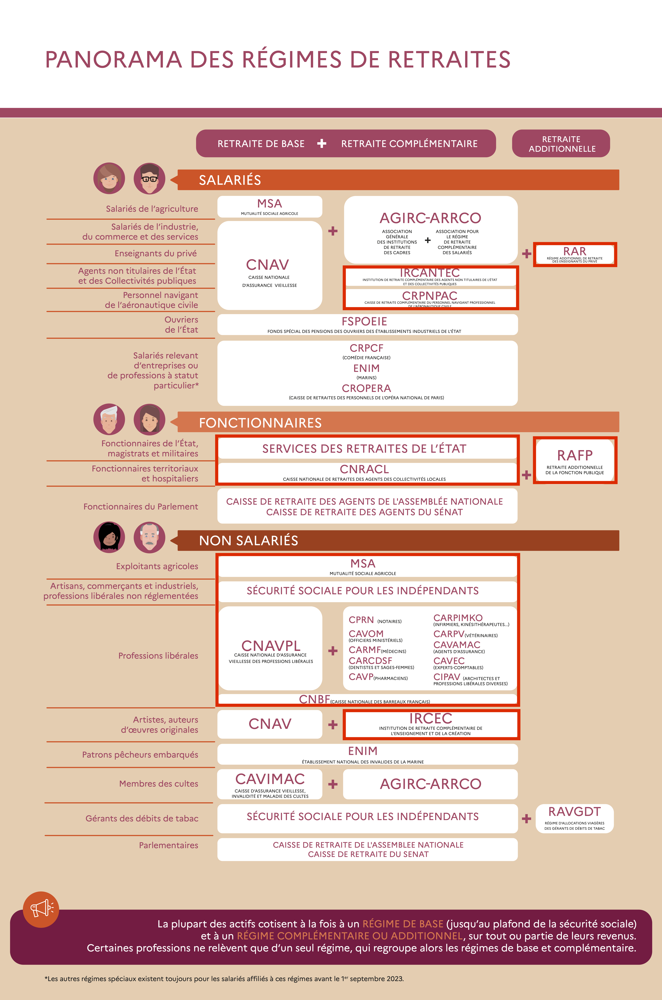

# Mémoire de Master – Conception et évaluation de politiques publiques dans le cadre des retraites

Ce dépôt contient l’ensemble des fichiers LaTeX utilisés pour rédiger mon mémoire de Master 2 en Ingénierie Statistique et Financière à l’Université Paris-Panthéon-Assas. Ce travail a été mené en alternance au sein de la Direction de la Sécurité Sociale (bureau 3C), sous la direction de Joseph Lanfranchi (Université Paris II Panthéon-Assas) et de Taha Benabdelaziz (Direction de la Sécurité Sociale).

## Résumé du mémoire

Ce mémoire traite de la mise en œuvre concrète de deux volets d’application de réformes des retraites : l'ouverture à la concurrence des lignes de bus de la RATP et la réforme de l’assiette sociale des travailleurs indépendants (TI) et des professions libérales (PL). La première réforme, initiée par le droit européen, vise à garantir la portabilité des droits à la retraite des salariés transférés à de nouveaux employeurs via un "sac à dos social". Ce dispositif assure la continuité des droits sociaux des agents RATP lors de la transition vers des entreprises privées.

La seconde réforme concerne la simplification du calcul des cotisations sociales des TI et PL, en fusionnant les assiettes de cotisations et de contributions sociales (CSG et CRDS). Cela vise à réduire les inégalités entre ces professions et les salariés, tout en améliorant la transparence du système et l’acquisition de droits sociaux.

Ces deux réformes, bien que distinctes, illustrent les défis actuels d'équité, de simplification administrative et de durabilité des régimes de retraite en France, enjeux majeurs pour les politiques publiques.

## Plan du mémoire

- **Introduction**
  - Présentation du cadre institutionnel : DSS, bureau 3C, rôle des pôles Retraite, PSC et Actuariat.
  - Missions confiées en alternance et méthodologie.

- **Chapitre 1 : Ouverture à la concurrence des lignes de bus RATP et portabilité des droits à la retraite**
  - 1.1 Cadre européen et historique de la mise en concurrence
  - 1.2 Spécificités du régime spécial de la RATP (emploi, rémunération, assiette)
  - 1.3 Mise en place du sac à dos social : arbitrages, simulations, modalités retenues

- **Chapitre 2 : Réforme de l’assiette sociale des travailleurs indépendants et des professions libérales**
  - 2.1 Panorama des régimes de retraite des TI et PL
  - 2.2 Contexte, objectifs et fondements juridiques de la réforme
  - 2.3 Outils de chiffrage et simulations (SICLOP, échanges avec les caisses, notes de cadrages)

- **Conclusion générale**
  - Bilan de l'expérience professionnelle et enseignements de la mission